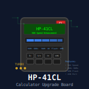

# hp-41_CL

## Tools for the HP-41CL by Systemyde (http://www.systemyde.com/hp41/index.html)

These tools help managing your HP-41CL system.

### RESTORE

This is a set of programs to restore and back up your HP-41CL settings and memory. Dependencies are the YFNX, Power-CL and Lib4 modules.

#### MMURST

Resets the MMU settings. It will first put YFNX into page E and display "YFNX PLUGGED". Pressing R/S will put LIB4 into Page 4, OSX3 into Page C and PWRX into Page D and then display "BASICS DONE". Again pressing R/S will plug ISEN into Page A and ISEM into page B and then HEPAX pages 808 and 809 into Pages 8 and 9 respectively and finally HPX2 into Page 7.

The whole procedure will result in this setup:

Page |Content
-----|-------
4    |LIB4
5    |(time)
6    |(free)
7    |HEPAX2 (modified HEPAX module)
8    |HEPAX RAM1 (from RAM page 808)
9    |HEPAX RAM2 (from RAM page 809)
A    |ISEN (ISENE module)
B    |ISEM (GEIR module)
C    |OSX3 (AMC OS/X)
D    |PWRX (Power CL)
E    |YFNX (41CL Extreme Functions)
F    |(free)

#### YFNZ7

Puts YFNZ (the standard CL module) into page 7.

#### YFNX7

Puts YFNX (41CL Extreme Functions) into page 7.

#### BACKUP

This program backs up all you need to various media. Dependencies are the YFNX, Power-CL (PWRX), CLILUP and Lib4 modules.

The program "FLASH" relies on PC41 (https://github.com/isene/pc41) for backup to your PC.

**BACKUP** stores RAM (page 800) into page 801. It then asks if you would like to also backup RAM and HEPAX pages to flash ("RAM+HEP>FL?"). Pressing R/S erases block 3F0000 and writes page 801 to Flash page 3F1 and HEPAX pages 808 and 809 to 3F2 and 3F3 respectively.

The program relies on the 3F0 Flash block being erased (check your HP-41CL manuals to verify that you have the right CL board for this block and change the appropriate program lines if needed).

Backup to Flash uses these pages in the 3F0 Flash block:

Flash block |Content
------------|-------
3F1         |RAM
3F2         |HEPAX1
3F3         |HEPAX2

####CL>NOV

This program takes iRAM pages 808 and 809 (HEPAX RAM) and copies them to pages 8 and 9 in the NOV module plugged. It first "cleans" the MMU and puts YFNZ in page #7 and tells you so. Press R/S and it will tell you to turn off the calculator and plug in your NoV module. Do that and press R/S and the program will commence to copy the pages (and tell you the progress as it does it). It will then tell you to turn off the calculator and unplug the module. And finally, after pressing R/S it will go straight to restoring your normal MMU (by going to MMURST).

####NOV>CL

This program takes pages 8 and 9 from a physically plugged in NoV module and backs them up to RAM pages 808 and 809. You can then use the BACKUP program to also back up these RAM pages to Flash.

### FLASH

This program makes for easier upgrades of Flash pages in you HP-41CL via the built-in serial port. Dependencies are the YFNF, YFNX, Power-CL and Lib4 modules - which means you cannot use the FLASH program to update these modules in the 41CL flash memory..

Upon execution, the program first shows the short form of labels A-E and then a-e as prompts:

**__INI F R + ↑__**

**__ERS W W8 F/R__**

Label (menu)    |Description
----------------|-----------
LBL A (INI) |Initializes (prepares for data transfer, setting Baud rate to 4800, Turbo to 50x, RAM page to 810, asks for Flash page)
LBL B (F) |Sets the Flash page (if another page is needed than initialized)
LBL C (R) |Sets the RAM page (if another page is needed than initialized)
LBL D (+) |Increments the RAM page by one
LBL E (↑) |Executes YIMP
LBL a (ERS) |Does YFERASE on the Flash page set
LBL b (W) |Does YFWR from the RAM page set to the Flash page set
LBL c (W8) |Does YFWR8 from the RAM page set to the Flash page set
LBL d (F/R) |Displays the current set Flash and RAM pages
LBL e |Go back to showing the program menu

Example: To update sector 1D0 of your HP-41CL, start by XEQ"FLASH". The program asks for the Flash page (enter 1D0) and press R/S.

Then the program asks if you want to copy the 8 pages starting from the flash address you just entered to RAM pages 810-817. Press Y for "Yes" and it will ask you to press SST to commence the copying. The reason I stop the program for you to manually press SST is that several of the built-in functions give feedback on progress only if the functions are entered manually. To skip the copying of the 8 flash pages, press N for "No".

The program is then initialized, showing "810000-0FFF" in the display.

You are now ready to transfer the first image into RAM page 810. Fire up PC41 on your PC with the right image to transfer (pc41 -w TIDES.ROM). 

The PC41 program will tell you to press YIMP first and then ENTER on your PC within a second to transfer the image. Press "E" on your HP-41 (LBL E executes the YIMP) and then ENTER on your PC. The image transfers. You now press "D" to increment the RAM page. It shows "811000-0FFF" indicating it is ready to receive the next page. On your PC, you type "pc41 -w PORTSL.ROM" to transfer the next image. Press "E", then ENTER on your PC, etc.

Upon doing a write to Flash (labels "b" or "c"), you can press R/S and the program will commence with checking if the image matches the CRC value of the FLDB database. A "MATCH" or "DIFF" will be displayed. Pressing R/S again will do the CRC check on the next Flash page, etc. You can also press "F" to do a CRC check on the currently set Flash page at any time.

Do continue uploading images after the first block of images, press "A" (INI) to start afresh.

### FCAT
Lists the content of flash pages according to IMDB from the address entered. Requires the YFNX and OSX3 modules.

## License
This software is released into the Public Domain.
